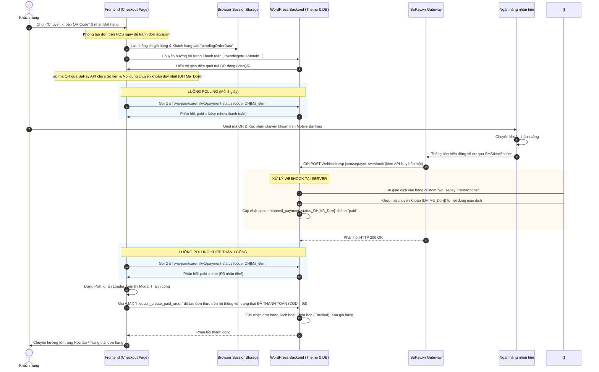

# HƯỚNG DẪN TÍCH HỢP THANH TOÁN TỰ ĐỘNG QUA VIETQR CODE VỚI SEPAY
> **Áp dụng:** Tích hợp phương thức chuyển khoản ngân hàng QR Code tự động cho Website/Theme E-learning (Hieucon) dựa trên kiến trúc tham chiếu từ Theme Caremil.

Tài liệu này tổng hợp toàn bộ **luồng nghiệp vụ, kiến trúc dữ liệu và hướng dẫn kỹ thuật chi tiết** để cấu hình cổng thanh toán tự động qua **SePay (sepay.vn)**. Hệ thống giúp khách hàng thanh toán quét mã QR chuẩn VietQR, nhận diện giao dịch tức thì qua Webhook và tự động kích hoạt khóa học/đơn hàng mà không cần duyệt tay.

---

## PHẦN I: TỔNG QUAN VỀ KIẾN TRÚC & LUỒNG NGHIỆP VỤ

Phương thức thanh toán QR Code của Caremil giải quyết triệt để bài toán **"Rác đơn hàng trên POS/Database"** và **"Xử lý giao dịch theo thời gian thực (Real-time)"** bằng quy trình tối ưu dưới đây:

### 1. Sơ đồ luồng dữ liệu (Data Flow)



### 2. Các thành phần công nghệ cốt lõi
1. **Bảng Custom Database (`wp_sepay_transactions`):** Lưu trữ toàn bộ lịch sử thô (raw) của các giao dịch do SePay gửi về nhằm mục đích đối soát chéo và chống thất thoát dữ liệu.
2. **REST API Webhook Endpoint (`sepay/v1/webhook`):** Điểm tiếp nhận dữ liệu từ SePay bảo mật bằng cơ chế Token/API Key.
3. **URL Rewrite Rewrite Rules (`/hooks/sepay-payment`):** Dự phòng cho các môi trường hosting chặn header đặc thù hoặc khó cấu hình REST API.
4. **REST API Polling Endpoint (`caremil/v1/payment-status`):** API public gọn nhẹ giúp Client-side JavaScript kiểm tra liên tục trạng thái thanh toán mà không làm quá tải hệ thống.
5. **SePay VietQR Image Service:** Dịch vụ sinh ảnh mã QR chuẩn ngân hàng động nhanh chóng mà không cần tích hợp SDK phức tạp.

---

## PHẦN II: HƯỚNG DẪN CẤU HÌNH TỪNG BƯỚC VỚI SEPAY.VN

Để triển khai hệ thống quét QR tự động cho cổng thanh toán trên website của bạn, hãy thực hiện theo 4 bước sau:

### BƯỚC 1: CHUẨN BỊ TÀI KHOẢN VÀ KẾT NỐI NGÂN HÀNG
1. Truy cập [sepay.vn](https://sepay.vn/) đăng ký tài khoản.
2. Tại dashboard SePay, chọn **"Liên kết ngân hàng"**.
3. Tiến hành kết nối tài khoản ngân hàng cá nhân hoặc doanh nghiệp của bạn (hỗ trợ MBBank, Vietcombank, Techcombank, ACB...). 
   - *Mẹo:* Bạn nên cài đặt ứng dụng ngân hàng và ứng dụng SePay trên điện thoại để cấp quyền nhận biến động số dư nhanh nhất qua thông báo ứng dụng (Notification).
4. Truy cập menu **"Tích hợp API" -> "API Keys"** để tạo một API Key mới. Lưu lại mã Key này (ví dụ: `sec_xxx_your_api_key_xxx`).

### BƯỚC 2: CẤU HÌNH WEBHOOK TRÊN SEPAY DASHBOARD
Để SePay biết nơi gửi dữ liệu khi tài khoản của bạn nhận được tiền, bạn phải đăng ký Webhook URL:
1. Vào mục **"Webhooks" -> "Thêm Webhook mới"**.
2. **Cấu hình Webhook:**
   - **URL nhận Webhook:** Địa chỉ trang web của bạn kèm đường dẫn REST API: 
     `https://yourdomain.com/wp-json/sepay/v1/webhook`
     *(Hoặc đường dẫn dự phòng ngắn: `https://yourdomain.com/hooks/sepay-payment`)*
   - **Phương thức:** `POST`
   - **Kiểu nội dung (Content-Type):** `application/json`
   - **Cấu hình Header bảo mật:** Thêm trường header:
     - Tên Header: `x-api-key`
     - Giá trị Header: Điền API Key SePay bạn đã copy ở Bước 1.
3. **Sự kiện nhận:** Tích chọn **"Giao dịch tiền vào" (Transfer In)**.
4. Nhấn **"Kiểm tra thử nghiệm"** để SePay giả lập gửi dữ liệu giao dịch mẫu. Nếu máy chủ phản hồi HTTP 200/201 là thành công. Sau đó nhấn **"Lưu cấu hình"**.

---

## PHẦN III: HƯỚNG DẪN VIẾT CODE TÍCH HỢP TRONG THEME

Dưới đây là toàn bộ mã nguồn PHP và JavaScript chuẩn hóa, được chia tách theo các chức năng rõ ràng. Bạn hãy đưa các phần này vào hệ thống của theme `hieucon`.

### 1. Tạo bảng lưu trữ giao dịch & Đăng ký Webhook API (Thêm vào `app/config/db-setup.php` hoặc `functions.php`)

Đoạn code này tự động khởi tạo bảng lưu trữ lịch sử giao dịch SePay khi theme chạy và đăng ký hai Endpoint Webhook tiếp nhận dữ liệu từ SePay:

```php
<?php
/**
 * 1. TỰ ĐỘNG TẠO BẢNG GIAO DỊCH SEPAY
 */
add_action('init', 'hieucon_sepay_auto_create_table');

function hieucon_sepay_auto_create_table() {
    global $wpdb;
    $table_name = $wpdb->prefix . 'sepay_transactions';

    // Tránh truy vấn lặp lại nếu bảng đã tồn tại
    $existing = $wpdb->get_var($wpdb->prepare('SHOW TABLES LIKE %s', $table_name));
    if ($existing === $table_name) {
        return;
    }

    $charset_collate = $wpdb->get_charset_collate();

    $sql = "CREATE TABLE {$table_name} (
        id mediumint(9) NOT NULL AUTO_INCREMENT,
        gateway varchar(100) NOT NULL,
        transaction_date datetime DEFAULT '0000-00-00 00:00:00' NOT NULL,
        account_number varchar(100) DEFAULT '' NOT NULL,
        sub_account varchar(250) DEFAULT '' NOT NULL,
        amount_in decimal(20,2) DEFAULT '0.00' NOT NULL,
        amount_out decimal(20,2) DEFAULT '0.00' NOT NULL,
        accumulated decimal(20,2) DEFAULT '0.00' NOT NULL,
        code varchar(250) DEFAULT '' NOT NULL,
        transaction_content text DEFAULT '' NOT NULL,
        reference_number varchar(255) DEFAULT '' NOT NULL,
        body text DEFAULT '' NOT NULL,
        created_at datetime DEFAULT CURRENT_TIMESTAMP NOT NULL,
        PRIMARY KEY  (id)
    ) {$charset_collate};";

    require_once ABSPATH . 'wp-admin/includes/upgrade.php';
    dbDelta($sql);
    error_log('SePay database table initialized: ' . $table_name);
}

/**
 * 2. CẤU HÌNH CÁC HẰNG SỐ & LẤY API KEY
 */
if (!defined('SEPAY_API_KEY')) {
    define('SEPAY_API_KEY', 'sec_your_copied_api_key_from_step_1'); // Thay thế bằng API Key thực tế của bạn
}
if (!defined('SEPAY_WEBHOOK_TOKEN')) {
    define('SEPAY_WEBHOOK_TOKEN', 'random_secure_token_for_url'); // Dành cho luồng dự phòng URL rewrite
}

function hieucon_get_sepay_api_key() {
    $env_key = getenv('SEPAY_API_KEY');
    if (!empty($env_key)) return $env_key;
    return SEPAY_API_KEY;
}

/**
 * 3. ĐĂNG KÝ REST API WEBHOOK CHO SEPAY
 * URL: /wp-json/sepay/v1/webhook
 */
add_action('rest_api_init', function () {
    register_rest_route('sepay/v1', '/webhook', array(
        'methods'             => 'POST',
        'callback'            => 'hieucon_handle_sepay_webhook',
        'permission_callback' => '__return_true', // Kiểm tra xác thực trong hàm callback
    ));
});

function hieucon_handle_sepay_webhook(WP_REST_Request $request) {
    global $wpdb;

    // A. Kiểm tra bảo mật API Key trong Headers
    $expected_key = hieucon_get_sepay_api_key();
    if (empty($expected_key)) {
        return new WP_Error('missing_key', 'SePay API Key is not configured in code.', array('status' => 500));
    }

    $provided_key = $request->get_header('x-api-key');
    if (empty($provided_key)) {
        $provided_key = $request->get_header('x-sepay-api-key');
    }
    // Hỗ trợ định dạng gửi Authorization: Apikey <KEY> từ SePay
    if (empty($provided_key)) {
        $auth_header = $request->get_header('authorization');
        if ($auth_header && preg_match('/Apikey\s+(.*)/i', $auth_header, $m)) {
            $provided_key = trim($m[1]);
        }
    }

    if ($expected_key !== $provided_key) {
        return new WP_Error('unauthorized', 'Mã xác thực API Key không hợp lệ.', array('status' => 401));
    }

    // B. Đọc và lọc sạch dữ liệu nhận được
    $params = $request->get_json_params();
    if (empty($params)) {
        return new WP_Error('no_data', 'Không nhận được dữ liệu dạng JSON', array('status' => 400));
    }

    // SePay Payload Mapping
    $data = array(
        'gateway'             => isset($params['gateway']) ? sanitize_text_field($params['gateway']) : '',
        'transaction_date'    => isset($params['transactionDate']) ? sanitize_text_field($params['transactionDate']) : '',
        'account_number'      => isset($params['accountNumber']) ? sanitize_text_field($params['accountNumber']) : '',
        'sub_account'         => isset($params['subAccount']) ? sanitize_text_field($params['subAccount']) : '',
        'code'                => isset($params['code']) ? sanitize_text_field($params['code']) : '', // Mã chuyển khoản SePay tự bóc tách bằng AI
        'transaction_content' => isset($params['content']) ? sanitize_textarea_field($params['content']) : '',
        'reference_number'    => isset($params['referenceCode']) ? sanitize_text_field($params['referenceCode']) : '',
        'body'                => isset($params['description']) ? sanitize_textarea_field($params['description']) : '',
        'accumulated'         => isset($params['accumulated']) ? floatval($params['accumulated']) : 0,
        'amount_in'           => 0,
        'amount_out'          => 0,
    );

    $transfer_amount = isset($params['transferAmount']) ? floatval($params['transferAmount']) : 0;
    $transfer_type   = isset($params['transferType']) ? sanitize_text_field($params['transferType']) : '';

    if ('in' === $transfer_type) {
        $data['amount_in'] = $transfer_amount;
    } elseif ('out' === $transfer_type) {
        $data['amount_out'] = $transfer_amount;
    }

    // C. Lưu dữ liệu thô vào database
    $table_name = $wpdb->prefix . 'sepay_transactions';
    $inserted = $wpdb->insert($table_name, $data);

    if ($inserted) {
        $transaction_id = $wpdb->insert_id;

        // Kích hoạt hook mở rộng nếu các dev khác muốn phát triển thêm tính năng
        do_action('hieucon_sepay_transaction_received', $transaction_id, $data);

        // Đánh dấu trạng thái thanh toán cho mã đơn này
        $payment_code = $data['code'];
        
        // Trường hợp SePay không tự lọc được mã code sạch bằng AI, tự Regex lại trong nội dung chuyển khoản
        if (empty($payment_code) && !empty($data['transaction_content'])) {
            if (preg_match('/DH[A-Za-z0-9]+/i', $data['transaction_content'], $matches)) {
                $payment_code = strtoupper($matches[0]); // Chuyển thành dạng viết hoa chuẩn hóa e.g. DH12345
            }
        }

        if (!empty($payment_code)) {
            hieucon_mark_order_paid($payment_code, $data);
        }

        return new WP_REST_Response(array(
            'success' => true,
            'id'      => $transaction_id,
        ), 200);
    }

    return new WP_Error('db_error', 'Không thể ghi nhận giao dịch vào CSDL.', array('status' => 500));
}

/**
 * 4. ĐÁNH DẤU TRẠNG THÁI ĐÃ NHẬN TIỀN CỦA ĐƠN HÀNG VÀO DATABASE WP
 */
function hieucon_mark_order_paid($order_code, $transaction) {
    $normalized = sanitize_text_field($order_code);
    if (empty($normalized)) {
        return;
    }

    // Lưu vào Options Database của WordPress với Key định danh duy nhất
    update_option(
        'hieucon_payment_status_' . $normalized,
        array(
            'status'     => 'paid',
            'updated_at' => current_time('mysql'),
            'transaction'=> $transaction,
        ),
        false
    );

    do_action('hieucon_order_paid', $normalized, $transaction);
}
```

### 2. Thiết lập cơ chế Polling REST API (Thêm vào `app/config/theme-settings.php` hoặc `functions.php`)

Đây là Endpoint public giúp Client-side JavaScript ở trình duyệt gọi liên tục (mỗi 5 giây) để kiểm tra xem webhook đã ghi nhận thanh toán thành công hay chưa:

```php
<?php
/**
 * ĐĂNG KÝ REST API KIỂM TRA TRẠNG THÁI THANH TOÁN (PUBLIC)
 * GET /wp-json/hieucon/v1/payment-status?code=DH123456
 */
add_action('rest_api_init', function () {
    register_rest_route('hieucon/v1', '/payment-status', array(
        'methods'             => WP_REST_Server::READABLE,
        'permission_callback' => '__return_true', // Route này public cho phía Client-side
        'callback'            => 'hieucon_rest_get_payment_status',
        'args'                => array(
            'code' => array(
                'required'          => true,
                'sanitize_callback' => 'sanitize_text_field',
            ),
        ),
    ));
});

function hieucon_rest_get_payment_status(WP_REST_Request $request) {
    $code = $request->get_param('code');
    if (empty($code)) {
        return new WP_Error('missing_code', 'Thiếu tham số mã đơn thanh toán (code).', array('status' => 400));
    }

    // Lấy thông tin trạng thái được lưu từ Webhook SePay
    $data = get_option('hieucon_payment_status_' . $code, null);
    
    if (empty($data)) {
        return rest_ensure_response(array(
            'paid'  => false,
            'code'  => $code,
            'found' => false,
        ));
    }

    return rest_ensure_response(array(
        'paid'       => isset($data['status']) && 'paid' === $data['status'],
        'code'       => $code,
        'updated_at' => isset($data['updated_at']) ? $data['updated_at'] : null,
        'transaction'=> isset($data['transaction']) ? $data['transaction'] : null,
    ));
}
```

### 3. AJAX Tạo đơn hàng & Kích hoạt học viên sau thanh toán (Thêm vào `app/controllers/class-account-controller.php` hoặc plugin backend)

Sau khi trình duyệt nhận diện được trạng thái `paid: true` qua Polling, nó sẽ tự động gửi AJAX lên server tạo đơn hàng thực và kích hoạt khóa học vào tài khoản của học viên:

```php
<?php
/**
 * ĐĂNG KÝ AJAX CHO PHẦN TẠO ĐƠN HÀNG ĐÃ THANH TOÁN ONLINE
 */
add_action('wp_ajax_hieucon_create_paid_order', 'hieucon_handle_create_paid_order');
add_action('wp_ajax_nopriv_hieucon_create_paid_order', 'hieucon_handle_create_paid_order');

function hieucon_handle_create_paid_order() {
    // 1. Xác thực bảo mật Nonce
    if (!isset($_POST['nonce']) || !wp_verify_nonce($_POST['nonce'], 'hieucon_payment_nonce')) {
        wp_send_json_error(array('message' => 'Phiên làm việc đã hết hạn. Vui lòng tải lại trang.'));
    }

    // 2. Kiểm tra Đăng nhập
    if (!is_user_logged_in()) {
        wp_send_json_error(array('message' => 'Vui lòng đăng nhập để hoàn tất đăng ký khóa học.'));
    }

    $current_user = wp_get_current_user();
    $user_id = $current_user->ID;

    // 3. Lấy dữ liệu input gửi lên
    $course_id = isset($_POST['course_id']) ? intval($_POST['course_id']) : 0;
    $amount    = isset($_POST['amount']) ? floatval($_POST['amount']) : 0;
    $code      = isset($_POST['code']) ? sanitize_text_field($_POST['code']) : ''; // e.g. DH12345

    if (!$course_id || !get_post($course_id)) {
        wp_send_json_error(array('message' => 'Khóa học không tồn tại.'));
    }

    // 4. KIỂM TRA CHÉO: Xác minh xem giao dịch thực sự đã nhận được tiền từ SePay chưa trên Database
    $payment_check = get_option('hieucon_payment_status_' . $code, null);
    if (empty($payment_check) || $payment_check['status'] !== 'paid') {
        wp_send_json_error(array('message' => 'Hệ thống chưa ghi nhận giao dịch chuyển khoản thực tế cho mã này.'));
    }

    // 5. KÍCH HOẠT KHÓA HỌC CHO HỌC VIÊN (Cập nhật User Meta '_enrolled_courses')
    $enrolled = get_option("hieucon_enrolled_courses_{$user_id}", null);
    if (!is_array($enrolled)) {
        $enrolled = array();
    }
    
    if (!in_array($course_id, $enrolled)) {
        $enrolled[] = $course_id;
        update_option("hieucon_enrolled_courses_{$user_id}", $enrolled, false);
    }

    // 6. TẠO ĐƠN HÀNG TRÊN HỆ THỐNG GHI NHẬN (Ví dụ: Pancake POS hoặc Custom Database Table)
    // Tùy theo hệ thống Hieucon đang dùng, bạn thực hiện gọi API Pancake POS tại đây với COD = 0đ 
    // vì tiền đã được chuyển và xác minh.
    
    // Ví dụ mẫu tạo đơn trên Pancake POS:
    /*
    $pancake_payload = array(
        'shop_id' => 12345,
        'customer' => array(
            'name' => $current_user->display_name,
            'phone_number' => get_user_meta($user_id, 'billing_phone', true) ?: '0901234567',
        ),
        'note' => "Đơn hàng kích hoạt tự động qua QR Code SePay cho Khóa học ID: {$course_id}",
        'transfer_money' => intval($amount),
        'cod_amount' => 0, // ĐÃ THANH TOÁN ONLINE
        'financial_status' => 'paid'
    );
    $response = hieucon_pancake_request('/shops/12345/orders', 'POST', $pancake_payload);
    */

    // 7. Xóa sạch Session và Option tạm sau khi thành công để giải phóng bộ nhớ
    delete_option('hieucon_payment_status_' . $code);

    wp_send_json_success(array(
        'message'      => 'Kích hoạt khóa học thành công!',
        'course_url'   => get_permalink($course_id)
    ));
}
```

### 4. Giao diện trang Thanh toán & JS Polling (Tạo file `page-templates/page-payment.php` của theme `hieucon`)

Hãy thiết kế giao diện thanh toán sang trọng, trực quan, hỗ trợ thiết bị di động, tự động tạo mã QR VietQR và bắt đầu luồng Polling kiểm tra trạng thái thanh toán bằng Javascript:

```php
<?php
/**
 * Template Name: Giao diện Thanh toán QR Code
 * Template Post Type: page
 * @package Hieucon
 */

if (!is_user_logged_in()) {
    wp_redirect(wp_login_url(get_permalink()));
    exit;
}

get_header();

// Lấy thông tin từ URL Query
$course_id = isset($_GET['course_id']) ? intval($_GET['course_id']) : 0;
$total_amount = isset($_GET['total']) ? floatval($_GET['total']) : 0;
$temp_order_id = isset($_GET['order_id']) ? sanitize_text_field($_GET['order_id']) : 'TEMP' . time();

$course_title = get_the_title($course_id);
?>

<!DOCTYPE html>
<html lang="vi">
<head>
    <meta charset="UTF-8">
    <meta name="viewport" content="width=device-width, initial-scale=1.0">
    <title>Thanh Toán Học Phí Chuyển Khoản QR Code - Hieucon</title>
    <!-- CSS Tailwind cho giao diện cao cấp -->
    <script src="https://cdn.tailwindcss.com"></script>
    <link href="https://cdnjs.cloudflare.com/ajax/libs/font-awesome/6.4.0/css/all.min.css" rel="stylesheet">
    <style>
        .copy-btn:active { transform: scale(0.95); }
        .scan-line {
            width: 100%; height: 3px; background: #10b981;
            position: absolute; z-index: 10;
            animation: scan 3s infinite linear;
            box-shadow: 0 0 8px #10b981;
        }
        @keyframes scan {
            0% { top: 0; opacity: 0; }
            10% { opacity: 1; }
            90% { opacity: 1; }
            100% { top: 100%; opacity: 0; }
        }
    </style>
</head>
<body class="bg-slate-50 text-slate-800 antialiased">
    <div class="min-h-screen py-12 px-4 flex items-center justify-center">
        <div class="max-w-4xl w-full bg-white rounded-3xl shadow-xl border border-slate-100 overflow-hidden grid grid-cols-1 md:grid-cols-12">
            
            <!-- CỘT TRÁI: HIỂN THỊ DÀNH CHO QUÉT MÃ QR (5 cột) -->
            <div class="md:col-span-5 bg-slate-900 p-8 flex flex-col items-center justify-center relative text-white">
                <div class="absolute top-4 left-4 flex items-center gap-1.5 text-xs text-slate-400 bg-slate-800/50 px-2.5 py-1 rounded-full border border-slate-700">
                    <i class="fas fa-lock text-emerald-500"></i> Thanh toán bảo mật
                </div>

                <div class="text-center mb-6 mt-4">
                    <p class="text-slate-400 text-xs font-semibold uppercase tracking-wider mb-1">Số tiền học phí</p>
                    <h2 class="text-3xl font-black text-emerald-400 font-mono"><?php echo number_format($total_amount, 0, ',', '.'); ?>đ</h2>
                    <p class="text-slate-400 text-[11px] mt-1 line-clamp-1"><?php echo esc_html($course_title); ?></p>
                </div>

                <!-- Ô quét QR -->
                <div class="relative w-60 h-60 bg-white p-2.5 rounded-2xl shadow-lg border border-slate-800 overflow-hidden flex items-center justify-center">
                    <div id="qrLoading" class="absolute inset-0 bg-slate-900 flex flex-col items-center justify-center gap-2 z-20">
                        <i class="fas fa-circle-notch fa-spin text-3xl text-emerald-400"></i>
                        <p class="text-[10px] text-slate-400 font-medium">Đang khởi tạo VietQR...</p>
                    </div>
                    
                    
                    
                    <!-- Hiệu ứng quét sáng laze xanh lá -->
                    <div class="absolute inset-0 pointer-events-none rounded-xl overflow-hidden">
                        <div class="scan-line"></div>
                    </div>
                </div>

                <div class="mt-4 text-center">
                    <p class="text-xs text-slate-400 flex items-center justify-center gap-1.5">
                        Mã QR hết hạn sau: 
                        <span id="countdownTimer" class="font-bold text-emerald-400 font-mono bg-slate-850 px-2 py-0.5 rounded border border-slate-700">15:00</span>
                    </p>
                </div>
            </div>

            <!-- CỘT PHẢI: HIỂN THỊ CHI TIẾT CHUYỂN KHOẢN (7 cột) -->
            <div class="md:col-span-7 p-8 md:p-10 flex flex-col justify-between">
                <div>
                    <h3 class="text-xl font-bold text-slate-800 mb-6 flex items-center gap-2 pb-4 border-b border-slate-100">
                        <span class="w-8 h-8 rounded-lg bg-emerald-50 flex items-center justify-center text-emerald-500"><i class="fas fa-university"></i></span>
                        Thông Tin Chuyển Khoản Thủ Công
                    </h3>

                    <!-- Cấu hình tài khoản nhận tiền -->
                    <div class="space-y-4">
                        <!-- Số tài khoản -->
                        <div onclick="copyText('acc-number', 'Số tài khoản')" class="bg-slate-50 border border-slate-200/60 rounded-xl p-4 cursor-pointer hover:border-slate-350 transition relative group">
                            <span class="text-[10px] font-bold text-slate-400 uppercase tracking-wider block mb-1">Số Tài Khoản Nhận</span>
                            <div class="flex justify-between items-center">
                                <span id="acc-number" class="text-xl font-mono font-extrabold text-slate-900 tracking-wider">VQRQAFUAF0842</span>
                                <button class="w-8 h-8 rounded-lg bg-white shadow-sm flex items-center justify-center text-slate-400 hover:text-emerald-500 border border-slate-200 copy-btn">
                                    <i class="far fa-copy"></i>
                                </button>
                            </div>
                        </div>

                        <div class="grid grid-cols-1 sm:grid-cols-2 gap-4">
                            <!-- Ngân hàng -->
                            <div class="bg-slate-50 border border-slate-200/60 rounded-xl p-4">
                                <span class="text-[10px] font-bold text-slate-400 uppercase block mb-1">Ngân Hàng</span>
                                <div class="flex items-center gap-2">
                                    
                                    <span class="font-bold text-slate-900 text-sm">MB Bank</span>
                                </div>
                            </div>
                            <!-- Tên chủ tài khoản -->
                            <div class="bg-slate-50 border border-slate-200/60 rounded-xl p-4">
                                <span class="text-[10px] font-bold text-slate-400 uppercase block mb-1">Chủ Tài Khoản</span>
                                <span class="font-bold text-slate-900 text-sm uppercase">Nguyễn Khánh Toàn</span>
                            </div>
                        </div>

                        <!-- Nội dung chuyển khoản (BẮT BUỘC CHÍNH XÁC) -->
                        <div onclick="copyText('transfer-content', 'Nội dung chuyển khoản')" class="bg-amber-50 border border-amber-200 rounded-xl p-4 cursor-pointer hover:border-amber-400 transition relative group">
                            <div class="flex justify-between items-center mb-1">
                                <span class="text-[10px] font-bold text-amber-700 uppercase tracking-wider flex items-center gap-1">
                                    <i class="fas fa-exclamation-triangle"></i> Nội Dung Chuyển Khoản (Bắt buộc)
                                </span>
                                <span class="text-[9px] bg-amber-500 text-white px-1.5 py-0.5 rounded font-extrabold shrink-0">BẮT BUỘC</span>
                            </div>
                            <div class="flex justify-between items-center">
                                <span id="transfer-content" class="text-lg font-mono font-bold text-slate-900">DH<?php echo esc_html($temp_order_id); ?></span>
                                <button class="w-8 h-8 rounded-lg bg-white shadow-sm flex items-center justify-center text-amber-600 border border-amber-200 copy-btn">
                                    <i class="far fa-copy"></i>
                                </button>
                            </div>
                        </div>
                    </div>
                </div>

                <!-- Phần trạng thái và nút đối soát ngay -->
                <div class="mt-8 pt-6 border-t border-slate-100 space-y-4">
                    <div class="flex items-center justify-between bg-slate-900 text-white rounded-2xl p-4 border border-slate-800">
                        <div class="flex items-center gap-2.5">
                            <span class="w-8 h-8 rounded-full bg-slate-850 flex items-center justify-center text-emerald-400 animate-pulse">
                                <i class="fas fa-circle-notch fa-spin text-sm"></i>
                            </span>
                            <div>
                                <p class="text-xs font-bold">Trạng thái thanh toán</p>
                                <p id="status-text" class="text-[11px] text-slate-450">Đang kiểm tra giao dịch tự động...</p>
                            </div>
                        </div>
                        <button id="btnCheckNow" class="text-xs px-3 py-1.5 bg-emerald-500 text-slate-900 font-bold rounded-lg hover:bg-emerald-400 transition">Kiểm tra ngay</button>
                    </div>

                    <p class="text-[11px] text-slate-400 text-center leading-relaxed">
                        Hệ thống đối soát SePay sẽ tự động ghi nhận giao dịch của bạn trong vòng 1-3 phút. Nếu có bất kỳ sự cố chậm trễ nào, vui lòng liên hệ hotline hỗ trợ.
                    </p>
                </div>
            </div>
        </div>
    </div>

    <!-- MODAL ĐỐI SOÁT & KÍCH HOẠT THÀNH CÔNG -->
    <div id="loadingModal" class="fixed inset-0 bg-slate-950/70 backdrop-blur-sm z-[99] hidden items-center justify-center p-4">
        <div class="bg-white rounded-3xl p-8 max-w-sm w-full text-center shadow-2xl">
            <div class="w-20 h-20 border-4 border-emerald-100 border-t-emerald-500 rounded-full animate-spin mx-auto mb-5 flex items-center justify-center">
                <i class="fas fa-check-double text-2xl text-emerald-400 animate-pulse"></i>
            </div>
            <h4 class="text-lg font-bold text-slate-800 mb-1">Giao Dịch Đã Ghi Nhận!</h4>
            <p class="text-xs text-slate-500">Đang đối soát an toàn và tự động kích hoạt tài khoản học viên...</p>
        </div>
    </div>

    <!-- MODAL THÀNH CÔNG -->
    <div id="successModal" class="fixed inset-0 bg-slate-950/70 backdrop-blur-sm z-[100] hidden items-center justify-center p-4">
        <div class="bg-white rounded-3xl p-8 max-w-sm w-full text-center shadow-2xl border-4 border-emerald-100">
            <div class="w-16 h-16 bg-emerald-50 border border-emerald-100 text-emerald-500 text-3xl rounded-full flex items-center justify-center mx-auto mb-5">
                <i class="fas fa-graduation-cap"></i>
            </div>
            <h4 class="text-xl font-black text-slate-900 mb-2">Đăng Ký Thành Công!</h4>
            <p class="text-xs text-slate-500 mb-6">Mã kích hoạt của khóa học <strong><?php echo esc_html($course_title); ?></strong> đã được thêm trực tiếp vào tài khoản của bạn.</p>
            <button id="btnStartLearning" class="w-full py-3 bg-slate-900 text-white font-bold rounded-xl hover:bg-slate-800 transition">Vào Học Ngay</button>
        </div>
    </div>

    <!-- JAVASCRIPT HẬU TRƯỜNG: POLLING & AJAX KÍCH HOẠT -->
    <script>
        const PAYMENT_CONFIG = {
            BANK_ID: 'MBBank', // Mã ngân hàng MBBank
            ACC_NO: 'VQRQAFUAF0842', // Số tài khoản ngân hàng nhận
            ACC_NAME: 'NGUYEN KHANH TOAN',
            TEMPLATE: 'qronly' // Lấy ảnh QR trơn không viền thông tin
        };

        const orderInfo = {
            courseId: <?php echo esc_js($course_id); ?>,
            amount: <?php echo esc_js($total_amount); ?>,
            code: 'DH<?php echo esc_js($temp_order_id); ?>',
            ajaxUrl: '<?php echo esc_js(admin_url('admin-ajax.php')); ?>',
            nonce: '<?php echo esc_js(wp_create_nonce('hieucon_payment_nonce')); ?>'
        };

        let pollingTimer = null;

        document.addEventListener('DOMContentLoaded', () => {
            // A. Khởi tạo và tải mã QR động từ SePay VietQR Image API
            const qrUrl = `https://qr.sepay.vn/img?bank=${PAYMENT_CONFIG.BANK_ID}&acc=${PAYMENT_CONFIG.ACC_NO}&template=${PAYMENT_CONFIG.TEMPLATE}&amount=${orderInfo.amount}&des=${encodeURIComponent(orderInfo.code)}`;
            
            const qrImgElement = document.getElementById('qrImage');
            qrImgElement.src = qrUrl;
            qrImgElement.onload = () => {
                document.getElementById('qrLoading').style.display = 'none';
                qrImgElement.style.display = 'block';
            };

            // B. Khởi chạy luồng đếm ngược và kiểm tra tự động Polling
            startTimer(900); // 15 phút đếm ngược
            startPaymentPolling();
        });

        // HÀM POLLING: Gọi API kiểm tra thanh toán mỗi 5 giây
        function startPaymentPolling() {
            // Kiểm tra ngay lần đầu
            checkStatusOnServer();
            // Lặp lại mỗi 5 giây
            pollingTimer = setInterval(checkStatusOnServer, 5000);
        }

        async function checkStatusOnServer(isManual = false) {
            try {
                const checkUrl = `${window.location.origin}/wp-json/hieucon/v1/payment-status?code=${encodeURIComponent(orderInfo.code)}`;
                const res = await fetch(checkUrl, { method: 'GET', cache: 'no-store' });
                const data = await res.json();

                if (res.ok && data && data.paid) {
                    clearInterval(pollingTimer);
                    updateStatusUI('Thanh toán thành công! Đang kích hoạt...', 'text-emerald-400');
                    
                    // Kích hoạt AJAX tạo đơn hàng và add khóa học cho học viên
                    await processActivation();
                } else {
                    if (isManual) {
                        showToast('Hệ thống chưa ghi nhận được khoản chuyển tiền. Vui lòng kiểm tra lại sau ít phút.');
                    }
                    updateStatusUI('Chờ giao dịch chuyển khoản...', 'text-amber-400');
                }
            } catch (err) {
                console.error("Lỗi khi kiểm tra thanh toán:", err);
                updateStatusUI('Lỗi đường truyền kết nối...', 'text-rose-450');
            }
        }

        // HÀM AJAX GỬI LÊN WP BACKEND ĐỂ GHI NHẬN ĐƠN VÀ KÍCH HOẠT HỌC VIÊN
        async function processActivation() {
            document.getElementById('loadingModal').classList.replace('hidden', 'flex');

            try {
                const formData = new URLSearchParams();
                formData.append('action', 'hieucon_create_paid_order');
                formData.append('nonce', orderInfo.nonce);
                formData.append('course_id', orderInfo.courseId);
                formData.append('amount', orderInfo.amount);
                formData.append('code', orderInfo.code);

                const response = await fetch(orderInfo.ajaxUrl, {
                    method: 'POST',
                    headers: { 'Content-Type': 'application/x-www-form-urlencoded' },
                    body: formData
                });

                const result = await response.json();
                document.getElementById('loadingModal').classList.replace('flex', 'hidden');

                if (result.success) {
                    // Hiển thị modal thành công
                    document.getElementById('successModal').classList.replace('hidden', 'flex');
                    document.getElementById('btnStartLearning').onclick = () => {
                        window.location.href = result.data.course_url;
                    };
                } else {
                    alert('Lỗi kích hoạt: ' + (result.data.message || 'Không rõ nguyên nhân'));
                    // Cho phép Polling lại nếu có lỗi
                    startPaymentPolling();
                }
            } catch (err) {
                document.getElementById('loadingModal').classList.replace('flex', 'hidden');
                alert('Đã có lỗi đường truyền kết nối xảy ra khi thực hiện kích hoạt khóa học.');
                startPaymentPolling();
            }
        }

        // CÁC HÀM TIỆN ÍCH DÀNH CHO GIAO DIỆN HÌNH THỂ VÀ TRẢI NGHIỆM
        function updateStatusUI(text, colorClass) {
            const el = document.getElementById('status-text');
            el.className = `text-[11px] font-bold ${colorClass}`;
            el.innerText = text;
        }

        function copyText(elementId, label) {
            const text = document.getElementById(elementId).innerText;
            navigator.clipboard.writeText(text).then(() => {
                showToast(`Đã sao chép ${label}: ${text}`);
            });
        }

        function showToast(msg) {
            let toast = document.getElementById('sepay-toast');
            if (!toast) {
                toast = document.createElement('div');
                toast.id = 'sepay-toast';
                toast.className = 'fixed bottom-4 right-4 bg-emerald-500 text-white font-bold px-5 py-3 rounded-xl shadow-xl z-[999] transition-all duration-300 transform translate-y-20 opacity-0';
                document.body.appendChild(toast);
            }
            toast.innerText = msg;
            toast.classList.replace('translate-y-20', 'translate-y-0');
            toast.classList.replace('opacity-0', 'opacity-100');
            setTimeout(() => {
                toast.classList.replace('translate-y-0', 'translate-y-20');
                toast.classList.replace('opacity-100', 'opacity-0');
            }, 3000);
        }

        function startTimer(duration) {
            let timer = duration, minutes, seconds;
            const display = document.getElementById('countdownTimer');
            const interval = setInterval(() => {
                minutes = parseInt(timer / 60, 10);
                seconds = parseInt(timer % 60, 10);

                minutes = minutes < 10 ? "0" + minutes : minutes;
                seconds = seconds < 10 ? "0" + seconds : seconds;

                display.textContent = minutes + ":" + seconds;

                if (--timer < 0) {
                    clearInterval(interval);
                    clearInterval(pollingTimer);
                    display.textContent = "Hết hạn";
                    updateStatusUI('Mã QR đã hết hạn hiệu lực.', 'text-rose-500');
                }
            }, 1000);
        }

        // Bắt nút Kiểm tra ngay thủ công
        document.getElementById('btnCheckNow').addEventListener('click', () => {
            checkStatusOnServer(true);
        });
    </script>
</body>
</html>

<?php
get_footer();
